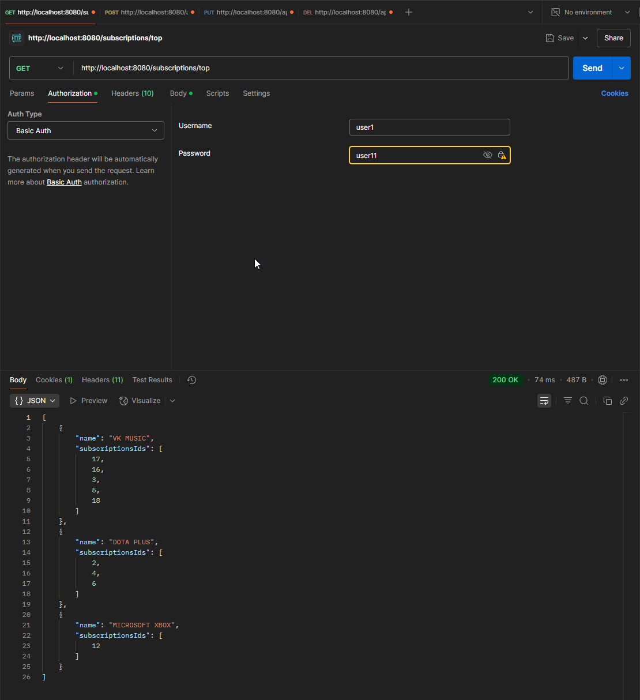
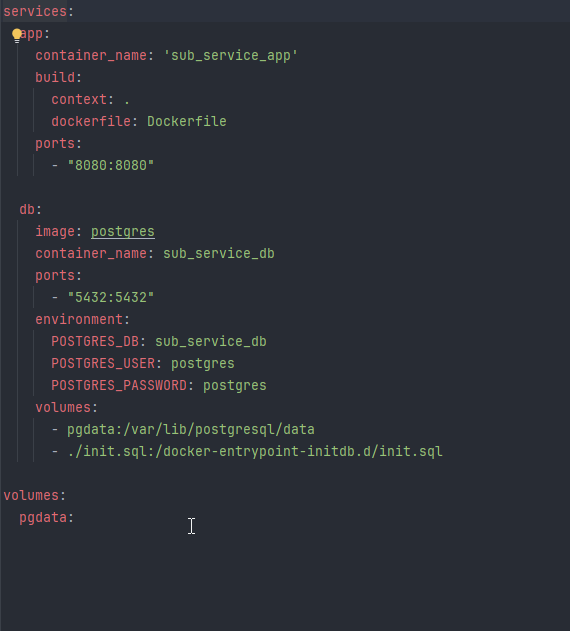

Инструкция к запуску приложения:
* docker-compose up db (оставляем включенным)
* mvn clean install "-Dspring.profiles.active=local" (в новом окне терминала параллельно 1-му пункту)
* стопаем через (ctrl + c) наш db (первый пункт)
* docker-compose up --build

Заранее созданные пользователи

Администратор:

логин: admin

пароль: user11

Обычные пользователи:

логин: user1

пароль: user11

логин: user2

пароль: user22

логин: user3

пароль: user33

...

логин: user9

пароль: user99

логин: user10

пароль: user100

Особенности:
* Пользователь может изменять только себя и свои подписки, в том числе и удалять.
* Ендпоинт именно создания пользователя, а не регистрации доступен только Админу.
* В приложении используется базовая авторизация:

* Пользователи заранее создаются скриптом инициализации, который вызывает Docker при первом запуске:

Техническое задание: Реализация микросервиса
### Описание задачи
Необходимо разработать микросервис на Spring Boot 3, который будет
предоставлять REST API для управления пользователями и их подписками на
сервисы.
Проект должен использовать Java 17
**Срок выполнения:** 2 дня.
### Функциональные требования

  API для управления пользователями
- Создание пользователя.
- Получение информации о пользователе.
- Обновление данных пользователя.
- Удаление пользователя.

  API для подписок
- Добавление подписки пользователю.
- Получение списка подписок пользователя.
- Удаление подписки.
- Подписки представляют собой подписки на цифровые сервисы, такие как
  YouTube Premium, VK Музыка, Яндекс.Плюс, Netflix и другие стриминговые
  платформы.

  Интеграция с базой данных
- Использовать PostgreSQL.
- Таблицы: users, subscriptions.

  Логирование
- Логирование через SLF4J.

  Docker
- Создать Dockerfile для развертывания сервиса.
- Разработать docker-compose.yml, который позволит локально запускать проект
  вместе с базой данных.

### Требования к API
Примерные эндпоинты:
* POST /users - создать пользователя
* GET /users/{id} - получить информацию о пользователе
* PUT /users/{id} - обновить пользователя
* DELETE /users/{id} - удалить пользователя
* POST /users/{id}/subscriptions - добавить подписку
* GET /users/{id}/subscriptions - получить подписки пользователя
* DELETE /users/{id}/subscriptions/{sub_id} - удалить подписку
* GET /subscriptions/top - получить ТОП-3 популярных подписок